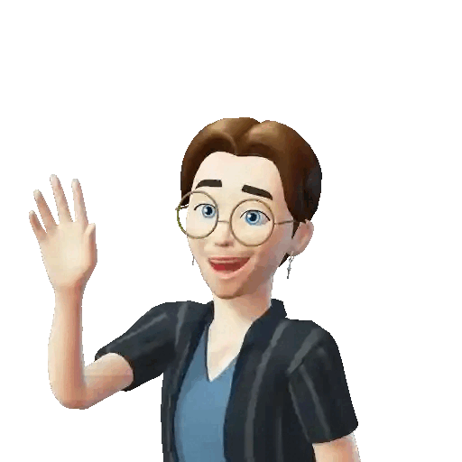

# Ayo! I'm Luca 👋
## AI engineer (student) & computer scientist based in Italy

AI re-ontologizing power is something so exciting and sometimes frightening at the same time it caught my eye just as the CHAT-GPT revolution came. At the time i told myself I wanted to be part of that, so here I'm trying to do my best while diving into such a thrilling field.

As someone once said, "with great power comes great responsibility" 🕷🕷🕷.
That's why I believe as engenieers we often have an under estimated responsibility in shaping peoples' life

---

Checkout my portfolio !
  

